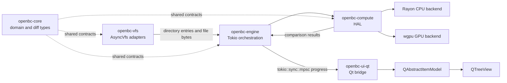

# OpenBC Architecture

OpenBC is a native comparison application organized as a dependency-directed Cargo workspace. UI concerns stay at the edge; domain, transport, and compute layers remain independently testable.

## Data flow

## Crate responsibilities

- `openbc-core`: dependency-light models, comparison policy, result types, and pure diff algorithms.
- `openbc-vfs`: `AsyncVfs`, metadata, directory streams, and local/remote adapters. Adapters must expose lazy directory levels.
- `openbc-compute`: execution policy and backends. It chooses CPU or GPU without leaking backend types to callers.
- `openbc-engine`: bounded Tokio pipelines. It requests one directory level at a time, performs metadata comparison first, then schedules phase-two content work.
- `openbc-ui-qt`: Qt event-loop integration and virtualized model state. It consumes progress messages and never performs scans itself.

## Thread safety and scheduling

1. Qt model methods run only on the Qt GUI thread.
2. Tokio tasks may perform asynchronous I/O and channel coordination, but never CPU-heavy hashing or synchronous blocking calls.
3. Rayon owns CPU-bound work. Configure its pool explicitly when embedding OpenBC so it cannot oversubscribe the host.
4. GPU submission happens through the compute backend and returns results to the engine. No GPU object crosses into the UI crate.
5. `ScanEvent` values are owned, serializable messages. The UI receives them through a bounded `tokio::sync::mpsc` bridge.
6. Backpressure is intentional: a full progress channel pauses producers rather than allowing unbounded memory growth.

## Performance policy

- Directory traversal is lazy and level-by-level. Expanding a node requests only that node's children.
- Metadata comparison (size and modified time) precedes content comparison.
- Small and medium files use the Rayon backend. The default GPU eligibility threshold is 4 MiB; files below 1 MiB must never be sent to a GPU.
- GPU transfers are chunked and bounded. A future implementation should use pinned or staging buffers and avoid mapping a file larger than the configured memory budget.
- Memory mapping is an optimization, not a correctness requirement. Do not map remote files or unbounded files; stream them through bounded buffers.
- If no compatible adapter is available, initialization fails into the CPU backend without affecting scan correctness.
- Hash algorithm selection belongs to core policy; backend implementations must return equivalent results for the same input.

## Failure model

VFS failures are attached to the affected path and emitted as scan events. A single unreadable file must not terminate unrelated sibling work. Fatal configuration and channel-closure errors terminate the scan with an explicit error.
