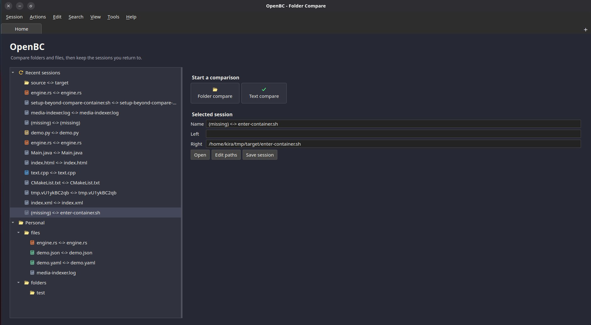
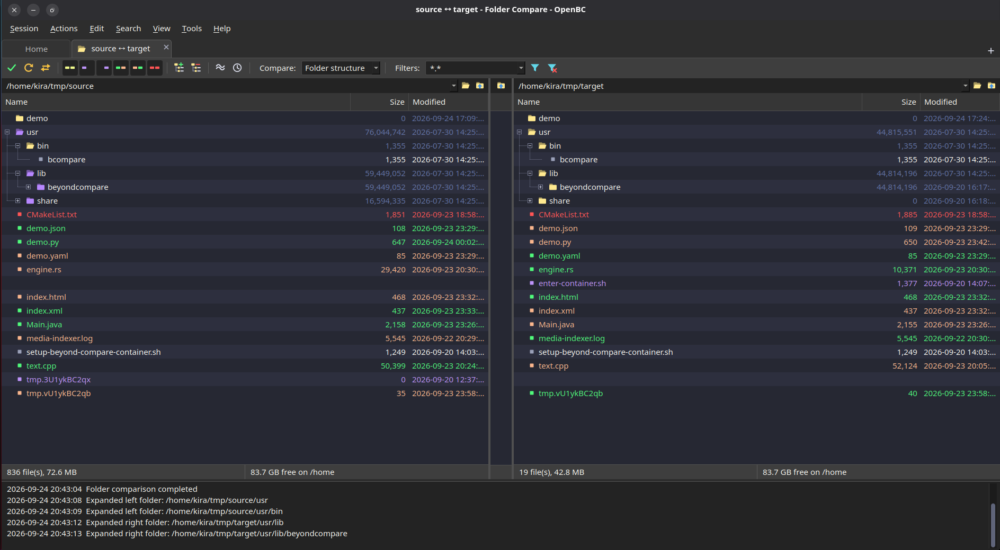
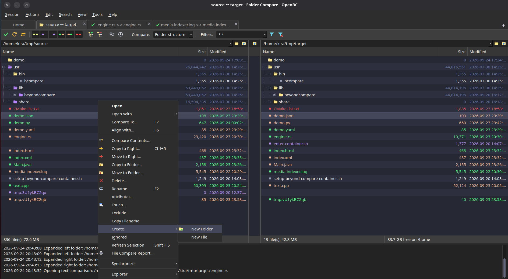

# OpenBC

OpenBC is an open-source, native file and folder comparison tool. It aims to become a capable, transparent alternative to [Beyond Compare](https://www.scootersoftware.com/), built in the open with a modern Rust core and a Qt desktop interface.

The project is actively evolving. The goal is not only to reproduce familiar comparison workflows, but to build a fast, extensible tool that the community can inspect, improve, and adapt.

## Product preview

These project assets show the visual direction for the desktop experience and its file-oriented workflows:

| Workspace | File operations | Comparison context |
| --- | --- | --- |
|  |  |  |

Additional UI and activity imagery is available in [`docs/imgs`](docs/imgs/).

## What is being built

- Native desktop comparison workflows for files and directories
- Lazy, level-by-level tree loading so large folders do not require an upfront recursive scan
- Metadata-first comparison followed by content work when needed
- Local and remote filesystem adapters through the VFS layer
- CPU-backed processing with a path toward capability-aware GPU acceleration
- A Qt model and UI that remain responsive while asynchronous work progresses
- An open architecture that keeps domain logic, filesystem access, compute, orchestration, and UI independently testable

The current architecture is documented in [`ARCHITECTURE.md`](ARCHITECTURE.md).

## Project structure

| Crate | Responsibility |
| --- | --- |
| `openbc-core` | Domain types, comparison policy, and diff algorithms |
| `openbc-vfs` | Filesystem and remote protocol adapters |
| `openbc-compute` | CPU/GPU execution backends |
| `openbc-engine` | Async orchestration and progress pipelines |
| `openbc-ui-qt` | Qt integration and virtualized model state |
| `xtask` | Build and development tasks |

## Getting started

### Prerequisites

- Rust with Cargo
- Qt development libraries and a C++17 toolchain
- CMake and a supported build tool such as Ninja or Make

### Check the workspace

```sh
cargo check --workspace
cargo test --workspace
```

For the Qt application, use the repository's platform setup and build scripts as described in [`build-launch.sh`](build-launch.sh) and [`setup.sh`](setup.sh).

## Contributing

OpenBC will be better with people who care about reliable, fast, and user-friendly comparison tools. Connect with the project by opening an issue, starting a discussion, or sending a pull request with a focused change.

Useful ways to contribute include:

- Build and run the project, then report reproducible bugs and UX friction
- Improve file and folder comparison behavior in `openbc-core`
- Add or harden local and remote adapters in `openbc-vfs`
- Improve hashing, diffing, scheduling, and performance in `openbc-compute` and `openbc-engine`
- Shape the Qt experience in `openbc-ui-qt`
- Add tests, benchmarks, platform support, and documentation
- Share workflows that Beyond Compare handles well and that an open alternative should support

Before making a larger change, read [`docs/CODING_GUIDELINES.md`](docs/CODING_GUIDELINES.md) and [`ARCHITECTURE.md`](ARCHITECTURE.md). Small, focused pull requests with tests and a clear explanation of the user problem are especially welcome.

## Community goal

A strong open-source alternative to Beyond Compare should be shaped by the people who use comparison tools every day. If you have experience with code review, release engineering, data migration, backups, binary files, remote systems, or accessibility, your perspective can help set the direction.

Connect, contribute, and help us build OpenBC into a dependable comparison tool that belongs to its users.

## License

OpenBC is dual-licensed under either of:

- [MIT License](https://opensource.org/licenses/MIT)
- [Apache License, Version 2.0](https://www.apache.org/licenses/LICENSE-2.0)
